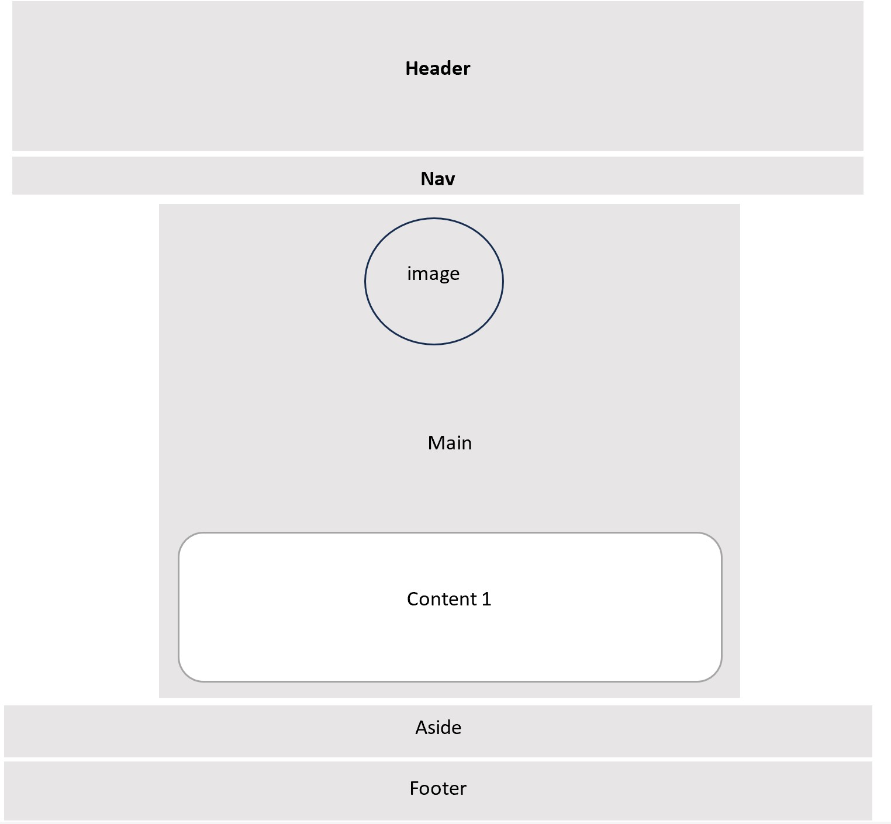

# Descripción de Sitio Web

Este es un sitio web informativo personal.

## Prototipo

> **En el Header y Algunas secciones se uso un tipo de letra no standar lo que genero una advertencia al momento de validar el css.**

Ejemplo:

## Contenido

- [index](#sección-1): introducción a mi perfil y algunas cosas que me pasaron.
- [Recreacion](#sección-2): descripción de lagunas actividades que me gusta practicar tanto en grupo como individual.
- [Reflexion](#Seccion-3): galería de imágenes y unas cuantas frases que me parecen interesantes para el día día.

## Contacto

Puedes contactarnos a través de [correo electrónico](mailto:uo299470@uniovi.es) 

## Enlaces de Interés

- [Repositorio](https://github.com/yarovi/presentacion-html.git)

